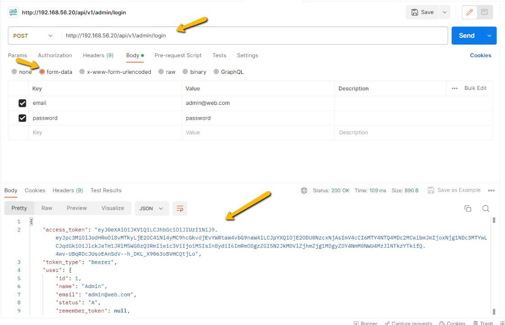
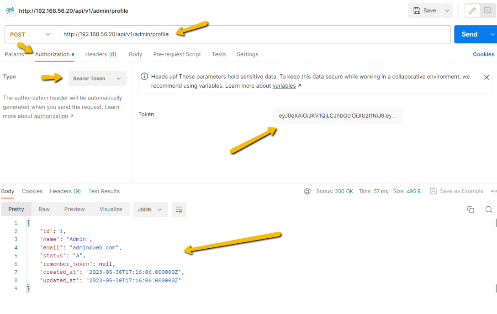
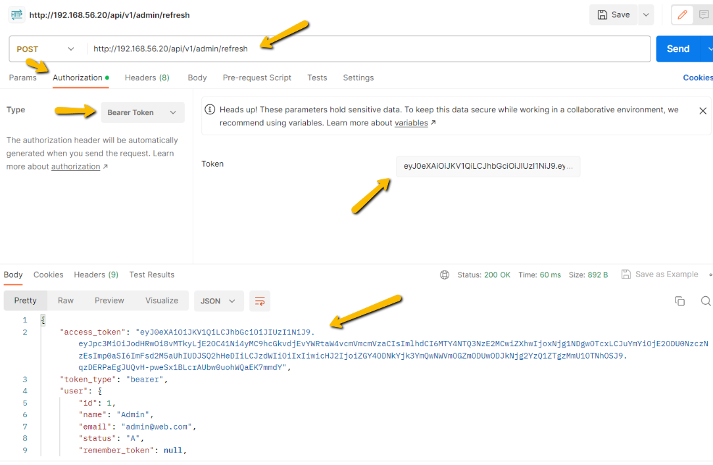
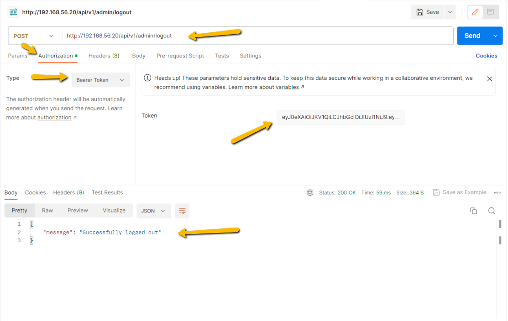


## Lumen 10 - Antenticação JWT

Passo a passo de autenticação JWT na API Lumen 10 para um multiplos tipos de usuários.

Será adicionado o usuário do tipo **Admin** que fará autenticação da mesma forma que outros usuários usando a mesma **API**, inclusive é possível adicionar diversos tipos de usuários, se necessário.

### Versões de softwares utilizados nesse tutorial

- Lumen 10.0.0

  https://lumen.laravel.com/docs/10.x

- tymon/jwt-auth 2.0.0

  https://github.com/tymondesigns/jwt-auth

### Requisitos mínimos

Ter uma API Lumen com a autenticação JWT configurada para um único tipo de usuário, no link abaixo mostro como configurar.

Recomendo seguir o passo a passo do link abaixo, pois assim já terá um tipo de usuário para autenticar e no decorrer desse tutorial, criaremos outro tipo usuário.

https://github.com/tiagotsc/lumen-jwt_single_user

### Siga as etapas

Os passos abaixo serão a partir da pasta raiz da sua **API**.

1 - Crie a tabela **admins**

````bash
# O comando gera um arquivo em database/migrations
php artisan make:migration create_admins_table
````

O arquivo é gerado em **database/migrations**.

Adicione o seguinte conteúdo:

````php
<?php

use Illuminate\Database\Migrations\Migration;
use Illuminate\Database\Schema\Blueprint;
use Illuminate\Support\Facades\Schema;

return new class extends Migration
{
    /**
     * Run the migrations.
     */
    public function up(): void
    {
        Schema::create('admins', function (Blueprint $table) {
            $table->id();
            $table->string('name');
            $table->string('email')->unique();
            $table->string('password');
            $table->enum('status', ['A', 'I'])->default('A');
            $table->rememberToken();
            $table->timestamps();
        });
    }

    /**
     * Reverse the migrations.
     */
    public function down(): void
    {
        Schema::dropIfExists('admins');
    }
};
````

Salve o arquivo e rode o **migrate**.

````bash
php artisan migrate
````

2 - Vamos gerar o **model** para o **admin**.

````bash
php artisan make:model Admin
````

O arquivo é gerado em **app/Models**.

E coloque o seguinte conteúdo:

````php
<?php

namespace App\Models;

use Illuminate\Auth\Authenticatable;
use Illuminate\Contracts\Auth\Access\Authorizable as AuthorizableContract;
use Illuminate\Contracts\Auth\Authenticatable as AuthenticatableContract;
use Illuminate\Database\Eloquent\Factories\HasFactory;
use Illuminate\Database\Eloquent\Model;
use Laravel\Lumen\Auth\Authorizable;
use Tymon\JWTAuth\Contracts\JWTSubject;

class Admin extends Model implements AuthenticatableContract, AuthorizableContract, JWTSubject
{
    use Authenticatable, Authorizable, HasFactory;

    /**
     * The attributes that are mass assignable.
     *
     * @var string[]
     */
    protected $fillable = [
        'name', 'email', 'password'
    ];

    /**
     * The attributes excluded from the model's JSON form.
     *
     * @var string[]
     */
    protected $hidden = [
        'password',
    ];

    /**
     * Get the identifier that will be stored in the subject claim of the JWT.
     *
     * @return mixed
     */
    public function getJWTIdentifier()
    {
        return $this->getKey();
    }

    /**
     * Return a key value array, containing any custom claims to be added to the JWT.
     *
     * @return array
     */
    public function getJWTCustomClaims()
    {
        return [];
    }
}
````

2 - Vamos criar um **Seeder** para registrar um usuário para **admin**.

````bash
# O comando gera um arquivo em database/seeders
php artisan make:seeder AdminSeeder
````

O arquivo é gerado em **database/seeders**.

Adicione o seguinte conteúdo:

````php
<?php

namespace Database\Seeders;

use App\Models\Admin;
use Illuminate\Database\Seeder;
use Illuminate\Support\Facades\Hash;
use Illuminate\Database\Console\Seeds\WithoutModelEvents;

class AdminSeeder extends Seeder
{
    /**
     * Run the database seeds.
     */
    public function run(): void
    {
        Admin::create([
            'name' => 'Admin', 
            'email' => 'admin@web.com',
            'password' => Hash::make('password')
        ]);
    }
}

````

3 - Rode o seed para criar o usuário admin de teste

````bash
php artisan db:seed --class=AdminSeeder
````

4 - No arquivo **config/auth.php** e vamos adicionar o **guard** de autenticação para o usuário do tipo **admin** e o provedor também.

````php
<?php

return [
    'guards' => [ # Procure por esse bloco do guard
        ... # Adicione o bloco abaixo
        'admin' => [
            'driver' => 'jwt',
            'provider' => 'admins',
        ],
    ],

    'providers' => [ # Procure por esse bloco do provedor
        ... # Adicione o bloco abaixo
        'admins' => [
            'driver' => 'eloquent',
            'model' => \App\Models\Admin::class
        ]
    ]
];
````

5 - Vamos criar o middleware que fará o lumen selecionar o **guard** correto por rota.

Na pasta **app/Http/Middleware**, crie o arquivo **AssignGuard.php**, com o conteúdo.

````php
<?php

namespace App\Http\Middleware;

use Closure;

class AssignGuard
{
    /**
     * Handle an incoming request.
     *
     * @param  \Illuminate\Http\Request  $request
     * @param  \Closure  $next
     * @return mixed
     */
    public function handle($request, Closure $next, $guard = null)
    {
        if($guard != null)
            auth()->shouldUse($guard);
        return $next($request);
    }
}
````

Depois registre esse **middleware** no arquivo **bootstrap/app.php**.

````php
$app->routeMiddleware([ # Procure esse bloco
    ... # Adicione a linha abaixo
    'assign.guard' => \App\Http\Middleware\AssignGuard::class
]);
````

6 - Agora é só adicionar as rotas no arquivo **routes/web.php**.

````php
$router->group(['prefix' => 'api/v1/admin'], function () use ($router) {

    $router->group(['middleware' => ['assign.guard:admin']], function () use ($router) {

        $router->post('login', 'AuthJWTController@login');
        $router->post('logout', 'AuthJWTController@logout');
        $router->post('refresh', 'AuthJWTController@refresh');
        $router->post('profile', 'AuthJWTController@profile');
        
    });
    
});
````

### Consumindo a API

Para os exemplos de consumo abaixo usei software **Postman**.
Segue abaixo link para download.

https://www.postman.com/downloads/

#### Autenticando e obtendo token

Use o método **POST** e a seguinte **URL**.

http://localhost:8000/api/v1/admin/login

Dados do usuário:

Email: admin@web.com

Senha: password



A partir de agora você usará esse token para consumir a **API**.

#### Obtendo dados do usuário logado

Use o método **POST** e a seguinte **URL**.

http://localhost:8000/api/v1/admin/profile

Clique na aba **Authorization**, na combo **Type**, selecione **Bearer Token**.

No campo **Token**, informe o token recebido anteriormente e clique em **Send**.



#### Obtendo um novo token

Use o método **POST** e a seguinte **URL**.

http://localhost:8000/api/v1/admin/refresh

Clique na aba **Authorization**, na combo **Type**, selecione **Bearer Token**.

No campo **Token**, informe o token recebido anteriormente e clique em **Send**.

Seu **token** anterior foi substituido por esse novo, portanto a partir de agora você de usar esse novo para consumir a **API**.



#### Deslogando da API

Use o método **POST** e a seguinte **URL**.

http://localhost:8000/api/v1/admin/logout

Clique na aba **Authorization**, na combo **Type**, selecione **Bearer Token**.

No campo **Token**, informe o token recebido anteriormente e clique em **Send**.

Seu **token** anterior foi substituido por esse novo, portanto a partir de agora você de usar esse novo para consumir a **API**.



Todo o tutorial aplicado aqui, já se encontra pronto para uso nesse repositório.

Se você tiver em seu SO o **Docker** e **Docker Compose**, basta clonar e subir o ambiente com os seguintes comandos.

````bash
# Sobe os containers
docker compose up -d

# Entra no container da API
docker compose exec php-fpm bash

# Instala os pacotes necessários para o Lumen
composer install

# Cria as tabelas do banco
php artisan migrate

# Registra o usuário de teste
php artisan db:seed --class=AdminSeeder

# Dados do banco de dados
Usuário: lumen_api
Senha: lumen_api
Banco de dados: lumen_api
Porta: 3306

# Força a parada dos containers
docker compose kill

# Remove todos os containers (Cuidado só execute em ambiente de testes)
docker rm -f $(docker ps -a -q)
````

#### Documentação oficial do pacote JWT utilizado

https://jwt-auth.readthedocs.io/

#### Documentação oficial do Docker

https://docs.docker.com

## 🔗 Links
[](https://www.linkedin.com/in/tiago-s-costa)
